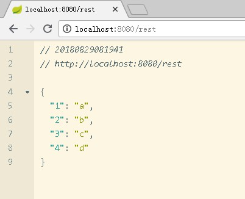

# spring-boot 01
## 依赖
```xml
    <!--spring boot web 依赖-->
    <dependency>
        <groupId>org.springframework.boot</groupId>
        <artifactId>spring-boot-starter-web</artifactId>
    </dependency>
    <!--spring web service-->
    <dependency>
        <groupId>org.springframework.boot</groupId>
        <artifactId>spring-boot-starter-ws</artifactId>
    </dependency>
    <!--spring boot 运维相关-->
    <dependency>
        <groupId>org.springframework.boot</groupId>
        <artifactId>spring-boot-starter-actuator</artifactId>
    </dependency>
```
## 配置
```properties
server.port=8080 # 服务端口
management.server.port=8081 # 运维使用端口
```
## 实例
- hello world
```java
import org.springframework.boot.SpringApplication;
import org.springframework.boot.autoconfigure.SpringBootApplication;
import org.springframework.stereotype.Controller;
import org.springframework.web.bind.annotation.RequestBody;
import org.springframework.web.bind.annotation.RequestMapping;
import org.springframework.web.bind.annotation.ResponseBody;
import org.springframework.web.bind.annotation.RestController;

import java.util.HashMap;
import java.util.Map;

@RestController
@SpringBootApplication
public class Demo01Application {

    public static void main(String[] args) {
        SpringApplication.run(Demo01Application.class, args);
    }


    @RequestMapping("/")
    public String index() {
        return "hello spring boot";
    }
}
```

- json
```java
import org.springframework.boot.SpringApplication;
import org.springframework.boot.autoconfigure.SpringBootApplication;
import org.springframework.stereotype.Controller;
import org.springframework.web.bind.annotation.RequestBody;
import org.springframework.web.bind.annotation.RequestMapping;
import org.springframework.web.bind.annotation.ResponseBody;
import org.springframework.web.bind.annotation.RestController;

import java.util.HashMap;
import java.util.Map;

@RestController
@SpringBootApplication
public class Demo01Application {

    public static void main(String[] args) {
        SpringApplication.run(Demo01Application.class, args);
    }


    @RequestMapping("/rest")
    @ResponseBody
    public Map<Integer, Object> rest() {
        Map<Integer, Object> data = new HashMap<Integer, Object>();
        data.put(1, "a");
        data.put(2, "b");
        data.put(3, "c");
        data.put(4, "d");
        return data;
    }
}
```

## 截图说明
- 访问 http://localhost:8080/


- 访问 http://localhost:8080/rest

