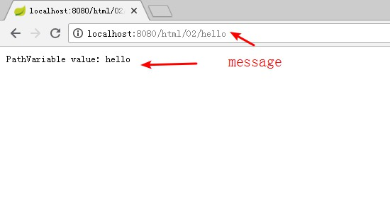
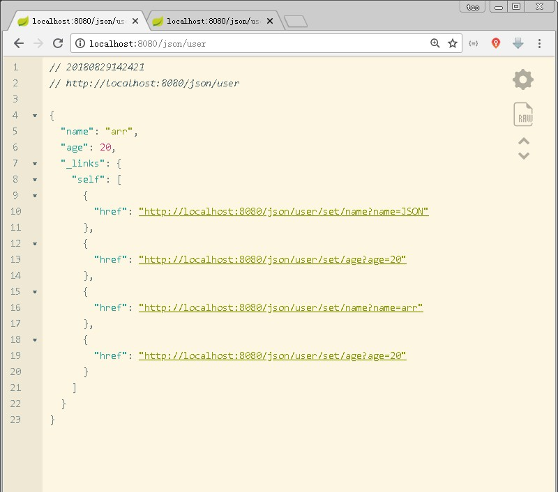

# spring-boot 02 
## REST 理论
```text
REST全称是Representational State Transfer，表现层状态转换。
```
- REST 架构属性
    - 性能
    - 可伸缩性
    - 统一接口简化性
    - 组件可修改性
    - 组件通讯可见性
    - 组件可移植性
    - 可靠性
- REST 架构约束
    - C/S架构
    - 无状态
    - 可缓存
    - 分层系统
    - 按需代码
    - 统一接口
        - 资源识别
            - URI
        - 资源操作
            - HTTP verbs: GET(获取),PUT(更新),POST(创建),DELETE(删除)
        - 自描述消息
            - Content-Type
            - MIME-Type
            - Media-Type: application/javascript,text/html
        - 超媒体

## REST 服务端实践
- Spring Boot REST
    - 接口
        - 定义
            - @Controller
            - @RestController
        - 映射
            - @RequestMapping
            - @PathVariable
        - 请求
            - @RequestParam
            - @RequestHeader
            - @CookieValue
            - @RequestEntity
        - 响应
            - @ResponseBody
            - @ResponseEntity

## HTML Response
- 服务端代码实例
```java
package com.lesson.demo02.controller;

import org.springframework.http.HttpHeaders;
import org.springframework.http.HttpStatus;
import org.springframework.http.ResponseEntity;
import org.springframework.web.bind.annotation.*;

import javax.servlet.http.Cookie;
import javax.servlet.http.HttpServletRequest;
import javax.servlet.http.HttpServletResponse;
import java.util.Arrays;

@RestController
public class HtmlRestDemoController {

    /***
     * RestController 返回网页
     * @return
     */
    @RequestMapping("/html/01")
    @ResponseBody
    public String html01() {
        return "<html><body>Hello,World</body></html>";
    }

    /***
     * url 参数 参数在//之间
     * @param message
     * @return
     */
    @GetMapping("/html/02/{message}")
    public String html02(@PathVariable String message) {
        return "<html><body>PathVariable value: " + message + "</body></html>";
    }

    /***
     * url 参数 参数在? 后用&符号相连接
     * @param param
     * @param request
     * @return
     */
    @GetMapping("/html/03/param")
    public String html03(@RequestParam(value = "p", required = false, defaultValue = "Empty") String param,
                         HttpServletRequest request) {

        // http://localhost:8080/html/03/param?p=hello
        String param2 = request.getParameter("param2");
        return "<html><body> Request Parameter1 value : " + param
                + " , parameter2 value :" + param2 +
                " </body></html>";
    }


    /***
     * 请求头
     * @param acceptHeader
     * @return
     */
    @GetMapping("/html/04/header")
    public String html04(@RequestHeader(value = "Accept") String acceptHeader) {
        return acceptHeader;
    }

    /***
     * 设置 cookies
     * @param wang
     * @param request
     * @param response
     * @return
     */
    @GetMapping("/html/05/cookie")
    public String html05(@CookieValue( required = false) String wang,
                         HttpServletRequest request,
                         HttpServletResponse response) {
        response.addCookie(new Cookie("foot", "bar"));
        Cookie[] cookies = request.getCookies();
        for (Cookie c : cookies) {
            System.out.println(c);
        }
        System.out.println(wang);
        return "success";
    }

    /***
     * ResponseEntity 用来设置 body 以及header
     * @return
     */
    @GetMapping("/html/06/response/entity")
    public ResponseEntity<String> html06(){

        HttpHeaders httpHeaders = new HttpHeaders();
        httpHeaders.put("myHeader", Arrays.asList("MyHeaderValue"));

        ResponseEntity responseEntity = new ResponseEntity("<html><body>entity OK</body></html>", httpHeaders, HttpStatus.OK);
        return responseEntity;
    }


}

```
- 访问如下
    - @ResponseBody 注解实例
        
    - @PathVariable 注解实例
        
    - @RequestParam 注解实例
        
    - @RequestHeader 注解实例
        
    - @CookieValue 注解实例
        
    - @ResponseEntity 注解实例
        
        
        
        

## JSON Response
```java
package com.lesson.demo02.controller;

import org.springframework.beans.factory.annotation.Autowired;
import org.springframework.beans.factory.annotation.Qualifier;
import org.springframework.context.annotation.Bean;
import org.springframework.http.MediaType;
import org.springframework.web.bind.annotation.GetMapping;
import org.springframework.web.bind.annotation.RequestParam;
import org.springframework.web.bind.annotation.RestController;

import static org.springframework.hateoas.mvc.ControllerLinkBuilder.linkTo;
import static org.springframework.hateoas.mvc.ControllerLinkBuilder.methodOn;

@RestController
public class JsonRestDemoController {

    @Autowired
    @Qualifier("currentUser")
    private User user;

    @Bean
    public User currentUser() {
        User user = new User();
        user.setName("JSON");
        user.setAge(20);
        return user;
    }

    @GetMapping(path = "/json/user", produces = MediaType.APPLICATION_JSON_VALUE)
    public User user() {
        user.add(linkTo(methodOn(JsonRestDemoController.class).setUserName(user.getName())).withSelfRel());
        user.add(linkTo(methodOn(JsonRestDemoController.class).setUserAge(user.getAge())).withSelfRel());
        return user;
    }

    //setName
    @GetMapping(path = "/json/user/set/name", produces = MediaType.APPLICATION_JSON_VALUE)
    public User setUserName(@RequestParam String name) {
        user.setName(name);
        return user;

    }

    //setAge
    @GetMapping(path = "/json/user/set/age",
            produces = MediaType.APPLICATION_JSON_VALUE)
    public User setUserAge(@RequestParam int age) {
        user.setAge(age);
        return user;
    }

}

```

- 访问如下
    - 
    - 
    

## REST DOC生成
- 依赖
```xml

<dependency>
    <groupId>io.springfox</groupId>
    <artifactId>springfox-swagger-ui</artifactId>
    <version>2.2.2</version>
</dependency>
<dependency>
    <groupId>io.springfox</groupId>
    <artifactId>springfox-swagger2</artifactId>
    <version>2.2.2</version>
</dependency>
```
- 配置 SwaggerConfig
```java
package com.lesson.demo02.restDoc;

import org.springframework.context.annotation.Bean;
import org.springframework.context.annotation.Configuration;
import springfox.documentation.builders.ApiInfoBuilder;
import springfox.documentation.builders.PathSelectors;
import springfox.documentation.builders.RequestHandlerSelectors;
import springfox.documentation.service.ApiInfo;
import springfox.documentation.spi.DocumentationType;
import springfox.documentation.spring.web.plugins.Docket;
import springfox.documentation.swagger2.annotations.EnableSwagger2;


@Configuration
@EnableSwagger2
public class SwaggerConfig {
    @Bean
    public Docket createRestApi() {
        return new Docket(DocumentationType.SWAGGER_2)
                .apiInfo(apiInfo())
                .select()
                .apis(RequestHandlerSelectors.basePackage("com.lesson.demo02")) // 当前项目路径
                .paths(PathSelectors.any())
                .build();
    }

    private ApiInfo apiInfo() {
        return new ApiInfoBuilder()
                .title("Spring Boot中使用Swagger2构建RESTful APIs")
                .description("Spring Boot")
                .termsOfServiceUrl("http://localhost:8080/")
                .contact("huifer")
                .version("1.0")
                .build();
    }
}
```

```网上有些地方说需要在application上增加@EnableSwagger2注解 ，但是在springboot2.x版本中不用增加也能够起到效果```

- 注解说明
<table>
    <thead>
    <tr>
        <th><strong>注解</strong></th>
        <th><strong>属性</strong></th>
        <th><strong>值</strong></th>
        <th><strong>备注</strong></th>
    </tr>
    </thead>
    <tbody>
        <tr>
            <td><code>@Api</code></td>
            <td>value</td>
            <td>字符串</td>
            <td>可用在<code>class</code>头上,<code>class</code>描述</td>
        </tr>
        <tr>
            <td></td>
            <td>description</td>
            <td>字符串</td>
            <td></td>
        </tr>
        <tr>
            <td></td>
            <td></td>
            <td></td>
            <td><code>@Api</code>(value = "xxx", description = "xxx")</td>
        </tr>
        <tr>
            <td><code>@ApiOperation</code></td>
            <td>value</td>
            <td>字符串</td>
            <td>可用在方法头上.参数的描述容器</td>
        </tr>
        <tr>
            <td></td>
            <td>notes</td>
            <td>字符串</td>
            <td></td>
        </tr>
        <tr>
            <td></td>
            <td></td>
            <td></td>
            <td><code>@ApiOperation</code>(value = "xxx", notes = "xxx")</td>
        </tr>
        <tr>
            <td><code>@ApiImplicitParams</code></td>
            <td>{}</td>
            <td><code>@ApiImplicitParam</code>数组</td>
            <td>可用在方法头上.参数的描述容器</td>
        </tr>
        <tr>
            <td></td>
            <td></td>
            <td></td>
            <td><code>@ApiImplicitParams</code>({<code>@ApiImplicitParam1</code>,<code>@ApiImplicitParam2</code>,...})</td>
        </tr>
        <tr>
            <td><code>@ApiImplicitParam</code></td>
            <td>name</td>
            <td>字符串 与参数命名对应</td>
            <td>可用在<code>@ApiImplicitParams</code>里</td>
        </tr>
        <tr>
            <td></td>
            <td>value</td>
            <td>字符串</td>
            <td>参数中文描述</td>
        </tr>
        <tr>
            <td></td>
            <td>required</td>
            <td>布尔值</td>
            <td>true/false</td>
        </tr>
        <tr>
            <td></td>
            <td>dataType</td>
            <td>字符串</td>
            <td>参数类型</td>
        </tr>
        <tr>
            <td></td>
            <td>paramType</td>
            <td>字符串</td>
            <td>参数请求方式:query/path</td>
        </tr>
        <tr>
            <td></td>
            <td></td>
            <td></td>
            <td>query:对应<code>@RequestParam</code>?传递</td>
        </tr>
        <tr>
            <td></td>
            <td></td>
            <td></td>
            <td>path: 对应<code>@PathVariable</code>{}path传递</td>
        </tr>
        <tr>
            <td></td>
            <td>defaultValue</td>
            <td>字符串</td>
            <td>在api测试中默认值</td>
        </tr>
        <tr>
            <td></td>
            <td></td>
            <td></td>
            <td>用例参见项目中的设置</td>
        </tr>
        <tr>
            <td><code>@ApiResponses</code></td>
            <td>{}</td>
            <td><code>@ApiResponse</code>数组</td>
            <td>可用在方法头上.参数的描述容器</td>
        </tr>
        <tr>
            <td></td>
            <td></td>
            <td></td>
            <td><code>@ApiResponses</code>({<code>@ApiResponse1</code>,<code>@ApiResponse2</code>,...})</td>
        </tr>
        <tr>
            <td><code>@ApiResponse</code></td>
            <td>code</td>
            <td>整形</td>
            <td>可用在<code>@ApiResponses</code>里</td>
        </tr>
        <tr>
            <td></td>
            <td>message</td>
            <td>字符串</td>
            <td>错误描述</td>
        </tr>
        <tr>
            <td></td>
            <td></td>
            <td></td>
            <td><code>@ApiResponse</code>(code = 200, message = "Success")</td>
        </tr>
    </tbody>
</table>

- 具体实例
```java
package com.lesson.demo02.controller;

import io.swagger.annotations.*;
import org.springframework.beans.factory.annotation.Autowired;
import org.springframework.beans.factory.annotation.Qualifier;
import org.springframework.context.annotation.Bean;
import org.springframework.http.MediaType;
import org.springframework.web.bind.annotation.GetMapping;
import org.springframework.web.bind.annotation.RequestParam;
import org.springframework.web.bind.annotation.RestController;

import static org.springframework.hateoas.mvc.ControllerLinkBuilder.linkTo;
import static org.springframework.hateoas.mvc.ControllerLinkBuilder.methodOn;

@RestController
@Api("JsonRest相关api")
public class JsonRestDemoController {

    @Autowired
    @Qualifier("currentUser")
    private User user;

    @Bean
    public User currentUser() {
        User user = new User();
        user.setName("JSON");
        user.setAge(20);
        return user;
    }

    @ApiOperation(value = "获取单个用户信息", notes = "获取用户信息")
    @GetMapping(path = "/json/user", produces = MediaType.APPLICATION_JSON_VALUE)
    public User user() {
        user.add(linkTo(methodOn(JsonRestDemoController.class).setUserName(user.getName())).withSelfRel());
        user.add(linkTo(methodOn(JsonRestDemoController.class).setUserAge(user.getAge())).withSelfRel());
        return user;
    }

    //setName
    @GetMapping(path = "/json/user/set/name", produces = MediaType.APPLICATION_JSON_VALUE)
    @ApiImplicitParams({
            @ApiImplicitParam(paramType = "query", name = "name", dataType = "String", required = false, value = "修改名称") // 注明 ： name 的值需要和函数参数名称一样 不然会多出一条无关参数记录
    })
    @ApiResponses({
            @ApiResponse(code = 200, message = "ok"),
            @ApiResponse(code = 400, message = "参数问题")
    })
    public User setUserName(@RequestParam String name) {
        user.setName(name);
        return user;

    }

    //setAge
    @GetMapping(path = "/json/user/set/age", produces = MediaType.APPLICATION_JSON_VALUE)
    @ApiImplicitParams({

            @ApiImplicitParam(paramType = "query", name = "age", dataType = "int", required = false, value = "修改年龄")
    })
    public User setUserAge(@RequestParam int age) {
        user.setAge(age);
        return user;
    }

}
```
- 截图


