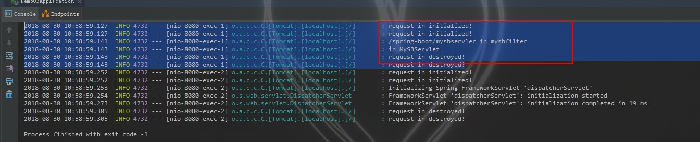

# Spring Boot Servlet
## 添加Servlet扫描路径
在Application 增加@ServletComponentScan注解
```java
package com.lesson.demo03;

import org.springframework.boot.SpringApplication;
import org.springframework.boot.autoconfigure.SpringBootApplication;
import org.springframework.boot.web.servlet.ServletComponentScan;

@SpringBootApplication
@ServletComponentScan(basePackages = {"com.lesson.demo03.servlet","com.lesson.demo03.filter"})
public class Demo03Application {

    public static void main(String[] args) {
        SpringApplication.run(Demo03Application.class, args);
    }
}

```

## 创建Servlet
1. 继承HttpServlet
2. 增加@WebServlet 注解
3. 重写doGet 函数

```java
package com.lesson.demo03.servlet;

import javax.servlet.ServletConfig;
import javax.servlet.ServletException;
import javax.servlet.annotation.WebInitParam;
import javax.servlet.annotation.WebServlet;
import javax.servlet.http.HttpServlet;
import javax.servlet.http.HttpServletRequest;
import javax.servlet.http.HttpServletResponse;
import java.io.IOException;
import java.io.Writer;

@WebServlet(
        name = "myServlet",// 名称
        urlPatterns = "/myservlet",// 映射 可多个
        initParams = {
                @WebInitParam(name = "me", value = "servlet")
        }
)
public class MyServlet extends HttpServlet {

    private String value;

    public void init(ServletConfig servletConfig) {
        value = servletConfig.getInitParameter("me");
    }


    /***
     * 定义一个自己的servlet
     * @param request
     * @param response
     * @throws ServletException
     * @throws IOException
     */
    @Override
    protected void doGet(HttpServletRequest request, HttpServletResponse response) throws ServletException, IOException {
        Writer writer = response.getWriter();
        writer.write("<html><body>hello servlet</body></html>");
        writer.write("<html><body>==>> "+value+"</body></html>");
    }
}

```

--

## 创建Filter
1. 继承OncePerRequestFilter
2. 增加@WebFilter 注解
3. 重写doFilterInternal 函数
```java
package com.lesson.demo03.filter;

import org.springframework.web.filter.OncePerRequestFilter;

import javax.servlet.FilterChain;
import javax.servlet.ServletContext;
import javax.servlet.ServletException;
import javax.servlet.annotation.WebFilter;
import javax.servlet.http.HttpServletRequest;
import javax.servlet.http.HttpServletResponse;
import java.io.IOException;

@WebFilter(servletNames = "myServlet")//servlet name
public class MyFilter extends OncePerRequestFilter {
    @Override
    protected void doFilterInternal(HttpServletRequest request, HttpServletResponse response, FilterChain filterChain) throws ServletException, IOException {

        ServletContext servletContext = request.getServletContext();
        servletContext.log("/myservlet in filtered"); // 通过日志的方式输出 访问myServlet对应的内容
        filterChain.doFilter(request, response);
    }
}

```

--

## 监听 WebListener
1. 实现 ServletRequestListener 或者其他监听接口
2. 增加@WebListener 注解

```java
package com.lesson.demo03.servlet;


import javax.servlet.ServletContext;
import javax.servlet.ServletRequestEvent;
import javax.servlet.ServletRequestListener;
import javax.servlet.annotation.WebListener;
import javax.servlet.http.HttpServletRequest;

@WebListener
public class MyServletRequestListener implements ServletRequestListener {
    @Override
    public void requestDestroyed(ServletRequestEvent sre) {
        //销毁的时候请求
        HttpServletRequest request = (HttpServletRequest) sre.getServletRequest();

        ServletContext servletContext = request.getServletContext();

        servletContext.log("request in destroyed!");

    }

    @Override
    public void requestInitialized(ServletRequestEvent sre) {
        //初始化的时候请求
        HttpServletRequest request = (HttpServletRequest) sre.getServletRequest();

        ServletContext servletContext = request.getServletContext();
        servletContext.log("request in initialized!");
    }
}
```


通过日志可以知道执行顺序    **_监听开始->filter->servlet->监听结束_**
--

## Spring Boot ServletApi
1. 扩展 Servlet 
2. 组装 Servlet
- Servlet
    ```java
    package com.lesson.demo03.springbootApi;
    
    import javax.servlet.ServletContext;
    import javax.servlet.ServletException;
    import javax.servlet.http.HttpServlet;
    import javax.servlet.http.HttpServletRequest;
    import javax.servlet.http.HttpServletResponse;
    import java.io.IOException;
    import java.io.Writer;
    
    public class MySBServlet extends HttpServlet {
        @Override
        protected void doGet(HttpServletRequest request, HttpServletResponse response) throws ServletException, IOException {
            Writer writer = response.getWriter();
    
            ServletContext servletContext = request.getServletContext();
    
            servletContext.log("in MySBServlet");
    
            writer.write("<html><body>MySBServlet</body></html>");
        }
    }
    
    ```

- Filter
    ```java
    package com.lesson.demo03.springbootApi;
    
    import org.springframework.web.context.request.RequestAttributes;
    import org.springframework.web.context.request.RequestContextHolder;
    import org.springframework.web.context.request.ServletRequestAttributes;
    import org.springframework.web.filter.OncePerRequestFilter;
    
    import javax.servlet.FilterChain;
    import javax.servlet.ServletContext;
    import javax.servlet.ServletException;
    import javax.servlet.http.HttpServletRequest;
    import javax.servlet.http.HttpServletResponse;
    import java.io.IOException;
    
    public class MySBFilter extends OncePerRequestFilter {
        @Override
        protected void doFilterInternal(HttpServletRequest request, HttpServletResponse response, FilterChain filterChain) throws ServletException, IOException {
    
            doSomething();
    
            filterChain.doFilter(request, response);
        }
    
        public void doSomething() {
    
            RequestAttributes requestAttributes = RequestContextHolder.getRequestAttributes();
    
            ServletRequestAttributes servletRequestAttributes = (ServletRequestAttributes) requestAttributes;
            HttpServletRequest request = servletRequestAttributes.getRequest();
    
            ServletContext servletContext = request.getServletContext();
    
            String requestURI = request.getRequestURI();
    
            servletContext.log(requestURI + " in mysbfilter");
    
        }
    }
    
    ```
- 监听
    监听直接配置 Bean即可使用

3. Spring Bean 配置
```java
package com.lesson.demo03;

import com.lesson.demo03.servlet.MyServletRequestListener;
import com.lesson.demo03.springbootApi.MySBFilter;
import com.lesson.demo03.springbootApi.MySBServlet;
import org.springframework.boot.SpringApplication;
import org.springframework.boot.autoconfigure.SpringBootApplication;
import org.springframework.boot.web.servlet.FilterRegistrationBean;
import org.springframework.boot.web.servlet.ServletComponentScan;
import org.springframework.boot.web.servlet.ServletListenerRegistrationBean;
import org.springframework.boot.web.servlet.ServletRegistrationBean;
import org.springframework.context.annotation.Bean;

import javax.servlet.DispatcherType;

@SpringBootApplication
@ServletComponentScan(basePackages = {"com.lesson.demo03.servlet", "com.lesson.demo03.filter"})
public class Demo03Application {

    public static void main(String[] args) {
        SpringApplication.run(Demo03Application.class, args);
    }

    /***
     * spring boot Servlet API Bean
     * @return
     */
    @Bean
    public static ServletRegistrationBean servletRegistrationBean() {

        ServletRegistrationBean servletRegistrationBean = new ServletRegistrationBean();

        servletRegistrationBean.setServlet(new MySBServlet());
        servletRegistrationBean.setName("mysbservler");
        servletRegistrationBean.addUrlMappings("/spring-boot/mysbservler");
        servletRegistrationBean.addInitParameter("myName", "myValue");

        return servletRegistrationBean;
    }

    /***
     * spring boot Filter API Bean
     * @return
     */
    @Bean
    public static FilterRegistrationBean filterRegistrationBean() {
        FilterRegistrationBean filterRegistrationBean = new FilterRegistrationBean();

        filterRegistrationBean.setFilter(new MySBFilter());
        filterRegistrationBean.addServletNames("mysbservler");

        filterRegistrationBean.setDispatcherTypes(DispatcherType.REQUEST, DispatcherType.FORWARD, DispatcherType.INCLUDE);

        return filterRegistrationBean;

    }

    /***
     * spring boot Listener API Bean
     * @return
     */
    @Bean
    public static ServletListenerRegistrationBean servletListenerRegistrationBean() {
        ServletListenerRegistrationBean servletListenerRegistrationBean = new ServletListenerRegistrationBean();
        servletListenerRegistrationBean.setListener(new MyServletRequestListener());
        return servletListenerRegistrationBean;
    }


}

```

---

