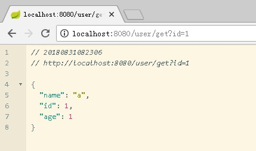
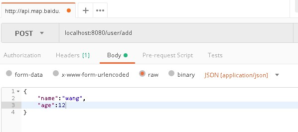
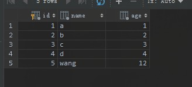

# Spring Boot JDBC
## 事务
- 事务触发时机
    - DML (操作数据库语句 如 insert) 执行后
    - DDL (数据库定义语句 如 create table) 执行后
    - SELECT 查询结果集关闭后
    - 存储过程执行好
--
## 依赖
```xml
<!--jdbc 依赖-->
<dependency>
    <groupId>org.springframework.boot</groupId>
    <artifactId>spring-boot-starter-jdbc</artifactId>
</dependency>
<!--mysql 驱动依赖-->
<dependency>
    <groupId>mysql</groupId>
    <artifactId>mysql-connector-java</artifactId>
    <scope>runtime</scope>
</dependency>
<!--dbcp 连接池依赖-->
<dependency>
    <groupId>org.apache.commons</groupId>
    <artifactId>commons-dbcp2</artifactId>
</dependency>
```
## 配置
```properties
spring.datasource.url=jdbc:mysql://localhost:3306/java?useSSL=false
spring.datasource.username=root
spring.datasource.password=root
spring.datasource.driver-class-name=com.mysql.jdbc.Driver

spring.datasource.type=org.apache.commons.dbcp2.BasicDataSource
spring.datasource.dbcp2.username=root
spring.datasource.dbcp2.password=root
spring.datasource.dbcp2.max-wait-millis=10000
spring.datasource.dbcp2.min-idle=5
spring.datasource.dbcp2.initial-size=5
spring.datasource.dbcp2.driver-class-name=com.mysql.jdbc.Driver
```
## JDBC controller
```java
package com.lesson.demo04.controller;

import com.lesson.demo04.pojo.User;
import org.springframework.beans.factory.annotation.Autowired;
import org.springframework.dao.DataAccessException;
import org.springframework.jdbc.core.JdbcTemplate;
import org.springframework.jdbc.core.PreparedStatementCallback;
import org.springframework.web.bind.annotation.*;

import javax.sql.DataSource;
import java.sql.*;
import java.util.HashMap;
import java.util.Map;

@RestController
public class JDBCController {

    @Autowired
    private DataSource dataSource;

    @Autowired
    private JdbcTemplate jdbcTemplate;


    /***
     * JDBC 方式查询数据库
     * @param id
     * @return
     */
    @GetMapping("/user/get")
    public Map<String, Object> getUser(@RequestParam(value = "id", defaultValue = "1") int id) {
        Map<String, Object> data = new HashMap<>();
        Connection connection = null;
        try {
            connection = dataSource.getConnection();
            connection.setAutoCommit(false);
            PreparedStatement statement = connection.prepareStatement("SELECT id,name,age FROM user WHERE id= ?"); // 防止sql注入

            statement.setInt(1, id);

            ResultSet resultSet = statement.executeQuery();

            while (resultSet.next()) {
                int uuid = resultSet.getInt("id");
                String name = resultSet.getString("name");
                int age = resultSet.getInt("age");

                data.put("id", uuid);
                data.put("name", name);
                data.put("age", age);
            }
        } catch (SQLException e) {
            e.printStackTrace();
        } finally {
            try {
                connection.setAutoCommit(true);
                connection.close();
            } catch (SQLException e) {
                e.printStackTrace();
            }

        }

        return data;
    }


    /***
     * JDBC 增加数据
     * @param user
     * @return
     */
    @PostMapping("/user/add")
    @ResponseBody
    public Map<String, Object> addUser(@RequestBody User user) {
        Map<String, Object> data = new HashMap<>();
        Boolean execute = jdbcTemplate.execute("INSERT  INTO user(name,age) VALUES (?,?);", new PreparedStatementCallback<Boolean>() {
            @Override
            public Boolean doInPreparedStatement(PreparedStatement ps) throws SQLException, DataAccessException {
                ps.setString(1, user.getName());
                ps.setInt(2, user.getAge());
                return ps.executeUpdate() > 0;
            }
        });

        data.put("success", execute);
        return data;

    }

}

```
- /user/get

    
- /user/add
    
    
    
    

## 自定义接口
```
自定义接口实际上是将 JDBC controller 抽象在实现的过程
```
- 定义接口
    ```java
    package com.lesson.demo04.service;
    
    import com.lesson.demo04.pojo.User;
    
    public interface UserService {
        boolean save(User user);
    
    }
    ```

- 接口实现
    ```java
    package com.lesson.demo04.service.impl;
    
    import com.lesson.demo04.pojo.User;
    import com.lesson.demo04.service.UserService;
    import org.springframework.beans.factory.annotation.Autowired;
    import org.springframework.dao.DataAccessException;
    import org.springframework.jdbc.core.JdbcTemplate;
    import org.springframework.jdbc.core.PreparedStatementCallback;
    import org.springframework.stereotype.Service;
    import org.springframework.transaction.PlatformTransactionManager;
    import org.springframework.transaction.TransactionStatus;
    import org.springframework.transaction.annotation.EnableTransactionManagement;
    import org.springframework.transaction.annotation.Transactional;
    import org.springframework.transaction.support.DefaultTransactionDefinition;
    
    import java.sql.PreparedStatement;
    import java.sql.SQLException;
    
    @Service
    @EnableTransactionManagement
    public class UserServiceImpl implements UserService {
    
        @Autowired
        private JdbcTemplate jdbcTemplate;
    
        @Autowired
        private PlatformTransactionManager platformTransactionManager;
    
        @Override
        public boolean save(User user) {
            Boolean execute = jdbcTemplate.execute("INSERT  INTO user(name,age) VALUES (?,?);", new PreparedStatementCallback<Boolean>() {
                @Override
                public Boolean doInPreparedStatement(PreparedStatement ps) throws SQLException, DataAccessException {
                    ps.setString(1, user.getName());
                    ps.setInt(2, user.getAge());
                    return ps.executeUpdate() > 0;
                }
            });
            return execute;
        }
    }
    ```
- 完整的JDBC controller
    ```java
    package com.lesson.demo04.controller;
    
    import com.lesson.demo04.pojo.User;
    import com.lesson.demo04.service.UserService;
    import org.springframework.beans.factory.annotation.Autowired;
    import org.springframework.dao.DataAccessException;
    import org.springframework.jdbc.core.JdbcTemplate;
    import org.springframework.jdbc.core.PreparedStatementCallback;
    import org.springframework.jdbc.core.StatementCallback;
    import org.springframework.web.bind.annotation.*;
    
    import javax.sql.DataSource;
    import java.sql.*;
    import java.util.*;
    
    @RestController
    public class JDBCController {
    
        @Autowired
        private DataSource dataSource;
    
        @Autowired
        private JdbcTemplate jdbcTemplate;
    
        @Autowired
        private UserService userService;
    
        /***
         * 是否支持事务
         * @return
         */
        @RequestMapping("/jdbc/meta/transaction/supported")
        public boolean supportedTransaction() {
    
            boolean supported = false;
    
            Connection connection = null;
    
            try {
                connection = dataSource.getConnection();
                DatabaseMetaData databaseMetaData = connection.getMetaData();
                supported = databaseMetaData.supportsTransactions();
            } catch (SQLException e) {
                throw new RuntimeException(e);
            }
    
            return supported;
    
        }
    
    
        /***
         * 获取表所有数据
         * @return
         */
        @RequestMapping("/users")
        public List<Map<String, Object>> getUsers() {
            return jdbcTemplate.execute(new StatementCallback<List<Map<String, Object>>>() {
                @Override
                public List<Map<String, Object>> doInStatement(Statement stmt) throws SQLException, DataAccessException {
                    ResultSet resultSet = stmt.executeQuery("SELECT * FROM user");
                    ResultSetMetaData metaData = resultSet.getMetaData();
    
                    int columnCount = metaData.getColumnCount();
    
                    List<String> columnNames = new ArrayList<>(columnCount);
    
                    for (int i = 1; i <= columnCount; i++) {
                        String columnName = metaData.getColumnName(i);
                        columnNames.add(columnName);
                    }
    
                    List<Map<String, Object>> data = new LinkedList<>();
    
                    while (resultSet.next()) {
    
                        Map<String, Object> columnData = new LinkedHashMap<>();  // 列名 值
    
                        for (String columnName : columnNames) {
    
                            Object columnValue = resultSet.getObject(columnName);
    
                            columnData.put(columnName, columnValue);
    
                        }
    
                        data.add(columnData);
    
    
                    }
    
                    return data;
                }
            });
        }
    
    
        /***
         * JDBC 方式查询数据库
         * @param id
         * @return
         */
        @GetMapping("/user/get")
        public Map<String, Object> getUser(@RequestParam(value = "id", defaultValue = "1") int id) {
            Map<String, Object> data = new HashMap<>();
            Connection connection = null;
            try {
                connection = dataSource.getConnection();
                connection.setAutoCommit(false);
                PreparedStatement statement = connection.prepareStatement("SELECT id,name,age FROM user WHERE id= ?"); // 防止sql注入
    
                statement.setInt(1, id);
    
                ResultSet resultSet = statement.executeQuery();
    
                while (resultSet.next()) {
                    int uuid = resultSet.getInt("id");
                    String name = resultSet.getString("name");
                    int age = resultSet.getInt("age");
    
                    data.put("id", uuid);
                    data.put("name", name);
                    data.put("age", age);
                }
                connection.commit();
            } catch (SQLException e) {
                e.printStackTrace();
            } finally {
                try {
                    connection.setAutoCommit(true);
                    connection.close();
                } catch (SQLException e) {
                    e.printStackTrace();
                }
    
            }
    
            return data;
        }
    
    
        /***
         * spring JDBC 增加数据
         * @param user
         * @return
         */
        @PostMapping("/user/add")
        @ResponseBody
        public Map<String, Object> addUser(@RequestBody User user) {
            Map<String, Object> data = new HashMap<>();
            Boolean execute = jdbcTemplate.execute("INSERT  INTO user(name,age) VALUES (?,?);", new PreparedStatementCallback<Boolean>() {
                @Override
                public Boolean doInPreparedStatement(PreparedStatement ps) throws SQLException, DataAccessException {
                    ps.setString(1, user.getName());
                    ps.setInt(2, user.getAge());
                    return ps.executeUpdate() > 0;
                }
            });
    
            data.put("success", execute);
            return data;
        }
    
        @PostMapping("/service/user/add")
        @ResponseBody
        public Map<String, Object> serviceAdd(@RequestBody User user) {
            Map<String, Object> data = new HashMap<>();
            boolean save = userService.save(user);
            data.put("success", save);
            return data;
    
        }
    
    
    }
    
    ```