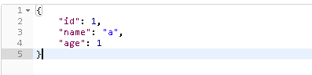

# Spring Boot Mybatis
## 配置
- pom.xml配置
    ```xml
    <?xml version="1.0" encoding="UTF-8"?>
    <project xmlns="http://maven.apache.org/POM/4.0.0" xmlns:xsi="http://www.w3.org/2001/XMLSchema-instance"
             xsi:schemaLocation="http://maven.apache.org/POM/4.0.0 http://maven.apache.org/xsd/maven-4.0.0.xsd">
        <modelVersion>4.0.0</modelVersion>
    
        <groupId>com.lesson</groupId>
        <artifactId>demo05</artifactId>
        <version>0.0.1-SNAPSHOT</version>
        <packaging>jar</packaging>
    
        <name>demo05</name>
        <description>Demo project for Spring Boot</description>
    
        <parent>
            <groupId>org.springframework.boot</groupId>
            <artifactId>spring-boot-starter-parent</artifactId>
            <version>2.0.4.RELEASE</version>
            <relativePath/> <!-- lookup parent from repository -->
        </parent>
    
        <properties>
            <project.build.sourceEncoding>UTF-8</project.build.sourceEncoding>
            <project.reporting.outputEncoding>UTF-8</project.reporting.outputEncoding>
            <java.version>1.8</java.version>
        </properties>
    
        <dependencies>
            <dependency>
                <groupId>org.springframework.boot</groupId>
                <artifactId>spring-boot-starter-jdbc</artifactId>
            </dependency>
            <dependency>
                <groupId>org.springframework.boot</groupId>
                <artifactId>spring-boot-starter-web</artifactId>
            </dependency>
            <dependency>
                <groupId>org.mybatis.spring.boot</groupId>
                <artifactId>mybatis-spring-boot-starter</artifactId>
                <version>1.3.2</version>
            </dependency>
    
            <dependency>
                <groupId>mysql</groupId>
                <artifactId>mysql-connector-java</artifactId>
                <!--<scope>runtime</scope>-->
            </dependency>
            <dependency>
                <groupId>org.springframework.boot</groupId>
                <artifactId>spring-boot-starter-test</artifactId>
                <scope>test</scope>
            </dependency>
        </dependencies>
    
        <build>
            <plugins>
                <plugin>
                    <groupId>org.springframework.boot</groupId>
                    <artifactId>spring-boot-maven-plugin</artifactId>
                </plugin>
    
                <plugin>
                    <groupId>org.mybatis.generator</groupId>
                    <artifactId>mybatis-generator-maven-plugin</artifactId>
                    <version>1.3.7</version>
                    <configuration>
                        <configurationFile>${basedir}/src/main/resources/generatorConfig.xml</configurationFile>
                        <overwrite>false</overwrite>
                        <verbose>true</verbose>
                    </configuration>
                    <executions>
                        <execution>
                            <id>Generate MyBatis Artifacts</id>
                            <goals>
                                <goal>generate</goal>
                            </goals>
                        </execution>
                    </executions>
                    <dependencies>
                        <dependency>
                            <groupId>org.hsqldb</groupId>
                            <artifactId>hsqldb</artifactId>
                            <version>2.3.4</version>
                        </dependency>
                    </dependencies>
                </plugin>
    
            </plugins>
    
            <resources>
                <resource>
                    <directory>src/main/java</directory>
                    <includes>
                        <include>**/*.xml</include>
                    </includes>
                </resource>
                <resource>
                    <directory>src/main/resources</directory>
                    <includes>
                        <include>**/*.*</include>
                    </includes>
                </resource>
            </resources>
        </build>
    
    
    
    </project>
    
    ```
- application.properties配置
    ```properties
    mybatis.mapper-locations=com.lesson.demo05.mapper/*.xml
    
    spring.datasource.driverClassName=com.mysql.jdbc.Driver
    spring.datasource.url=jdbc:mysql://localhost:3306/java
    spring.datasource.username=root
    spring.datasource.password=root
    ```

- generatorConfig
    ```xml
    <?xml version="1.0" encoding="UTF-8"?>
    <!DOCTYPE generatorConfiguration
            PUBLIC "-//mybatis.org//DTD MyBatis Generator Configuration 1.0//EN"
            "http://mybatis.org/dtd/mybatis-generator-config_1_0.dtd">
    <generatorConfiguration>
        <classPathEntry
                location="D:\Program Files\MavenRepository\mysql\mysql-connector-java\5.1.46\mysql-connector-java-5.1.46.jar"/>
        <context id="TestTables">
    
    
            <commentGenerator>
                <property name="suppressAllComments" value="false"/>
                <property name="suppressDate" value="true"/>
            </commentGenerator>
            <!-- 数据库的相关配置 -->
            <jdbcConnection driverClass="com.mysql.jdbc.Driver" connectionURL="jdbc:mysql://localhost:3306/java" userId="root"
                            password="root"/>
            <javaTypeResolver>
                <property name="forceBigDecimals" value="false"/>
            </javaTypeResolver>
            <!-- 实体类生成的位置 -->
            <javaModelGenerator targetPackage="com.lesson.demo05.entity" targetProject="src/main/java">
                <property name="enableSubPackages" value="false"/>
                <property name="trimStrings" value="true"/>
            </javaModelGenerator>
            <!-- *Mapper.xml 文件的位置 -->
            <sqlMapGenerator targetPackage="com.lesson.demo05.mapper" targetProject="src/main/java">
                <property name="enableSubPackages" value="false"/>
            </sqlMapGenerator>
            <!-- Mapper 接口文件的位置 -->
            <javaClientGenerator targetPackage="com.lesson.demo05.mapper" targetProject="src/main/java"
                                 type="XMLMAPPER">
                <property name="enableSubPackages" value="false"/>
            </javaClientGenerator>
    
    
            <table tableName="user">
                <generatedKey column="id" sqlStatement="mysql" identity="true"/>
                <columnOverride column="name" property="name"/>
                <columnOverride column="age" property="age"/>
    
            </table>
        </context>
    </generatorConfiguration>
    ```
    
```text
以上内容配置为 generator - maven 插件配置 用于自动生成Mybatis相关文件 
```
- Controller
    ```java
    package com.lesson.demo05.controller;
    
    import com.lesson.demo05.entity.User;
    import com.lesson.demo05.service.MyBatisService;
    import org.springframework.beans.factory.annotation.Autowired;
    import org.springframework.web.bind.annotation.GetMapping;
    import org.springframework.web.bind.annotation.PathVariable;
    import org.springframework.web.bind.annotation.RestController;
    
    @RestController
    public class MybatisController {
    
        @Autowired
        private MyBatisService myBatisService;
    
    
        @GetMapping("/user/{id}")
        public User get(@PathVariable Integer id) {
            System.out.println("=================");
            System.out.println(id);
            User getid = myBatisService.getid(id);
            System.out.println(getid);
            return getid;
        }
    
    
    }
    
    ```
- Service
    
    ```java
    package com.lesson.demo05.service;
    
    import com.lesson.demo05.entity.User;
    
    public interface MyBatisService {
        User getid(Integer id);
    }
    
    ```
- impl
    ```java
    package com.lesson.demo05.service.impl;
    
    import com.lesson.demo05.entity.User;
    import com.lesson.demo05.mapper.UserMapper;
    import com.lesson.demo05.service.MyBatisService;
    import org.springframework.beans.factory.annotation.Autowired;
    import org.springframework.stereotype.Service;
    
    @Service
    public class MyBatisServiceImpl implements MyBatisService {
        @Autowired
        private UserMapper userMapper;
    
        @Override
        public User getid(Integer id) {
            System.out.println(id);
            User user = userMapper.selectByPrimaryKey(id);
            return user;
        }
    }
    
    ```
## 备注
- @mapper注解
    - 使用@MapperScan({"com.lesson.demo05.mapper"}) 扫描方式可以避免多次填写、遗漏@mapper 

- 截图
    
    