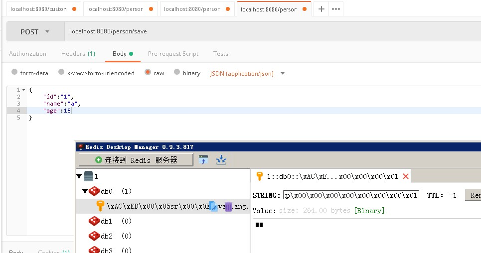
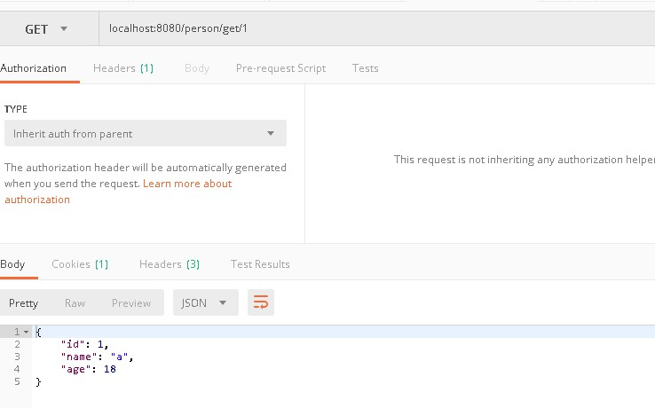
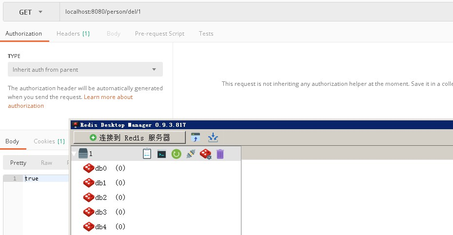

# Spring Boot Redis
## 配置
```properties
# redis ip 地址
spring.redis.host=localhost
# redis port 端口
spring.redis.port=6379
# redis password 密码
spring.redis.password=
# redis timeout 超时 毫秒
spring.redis.timeout=20000
# redis 数据库索引（默认为0）
spring.redis.database=0
```
## repository RedisTemplate操作
- 接口
```java
package com.lesson.demo07.repository;

import com.lesson.demo07.entity.Person;
import org.springframework.cache.annotation.Cacheable;
import org.springframework.data.repository.NoRepositoryBean;

@NoRepositoryBean
public interface PersonRepository {

    @Cacheable(cacheNames = "persons")
    Person findPerson(Long id);

    boolean savePerson(Person person);

    boolean delPerson(Long id);

}

```
- 实现
```java
package com.lesson.demo07.repository.impl;

import com.lesson.demo07.entity.Person;
import com.lesson.demo07.repository.PersonRepository;
import com.sun.org.apache.regexp.internal.RE;
import org.springframework.beans.factory.annotation.Autowired;
import org.springframework.data.redis.core.RedisTemplate;
import org.springframework.stereotype.Repository;

import java.util.HashMap;
import java.util.Map;

@Repository
public class PersonRepositoryImpl implements PersonRepository {
    private final Map<String, Person> repoistory = new HashMap<>();

    @Autowired
    private RedisTemplate redisTemplate;

    @Override
    public boolean delPerson(Long id) {
        redisTemplate.delete(id);
        return true;
    }


    @Override
    public Person findPerson(Long id) {

        Person person = (Person) redisTemplate.opsForValue().get(id);

        return person;
    }

    @Override
    public boolean savePerson(Person person) {
        redisTemplate.opsForValue().set(person.getId(), person);

        return true;
    }
}

```
## controller
```java
package com.lesson.demo07.controller;

import com.lesson.demo07.entity.Person;
import com.lesson.demo07.repository.PersonRepository;
import com.sun.org.apache.xpath.internal.operations.Bool;
import org.springframework.beans.factory.annotation.Autowired;
import org.springframework.web.bind.annotation.*;

@RestController
@RequestMapping("person")
public class PersonController {
    @Autowired
    private PersonRepository personRepository;

    @PostMapping("/save")
    public Person save(@RequestBody Person person) {
        personRepository.savePerson(person);
        return person;
    }

    @GetMapping("/get/{id}")
    public Person get(@PathVariable Long id) {
        return personRepository.findPerson(id);
    }

    @GetMapping("/del/{id}")
    public boolean del(@PathVariable Long id) {
        return personRepository.delPerson(id);
    }
}

```

- 截图



