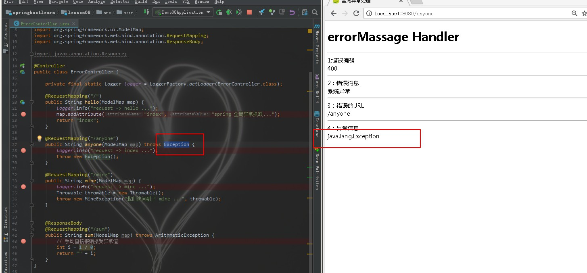
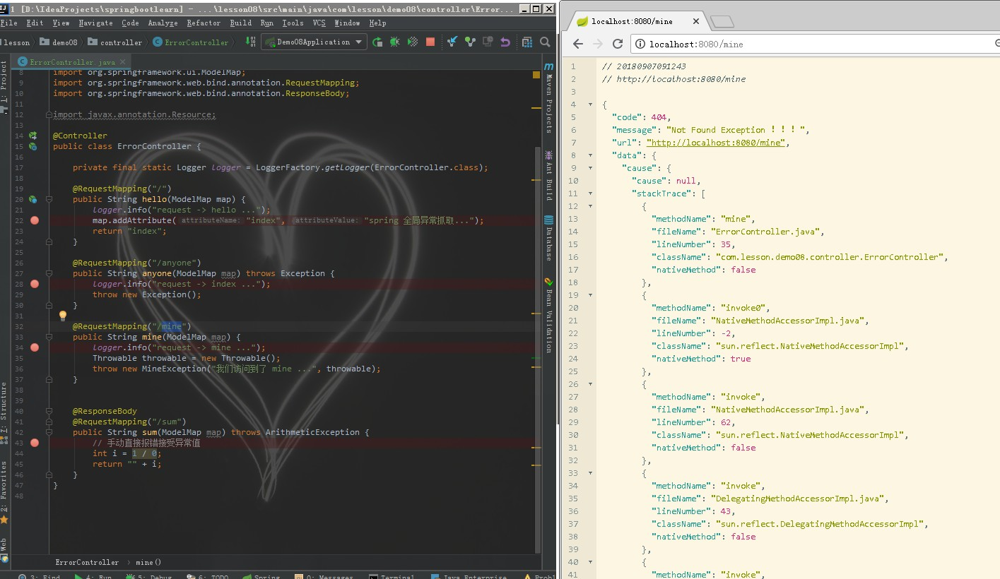
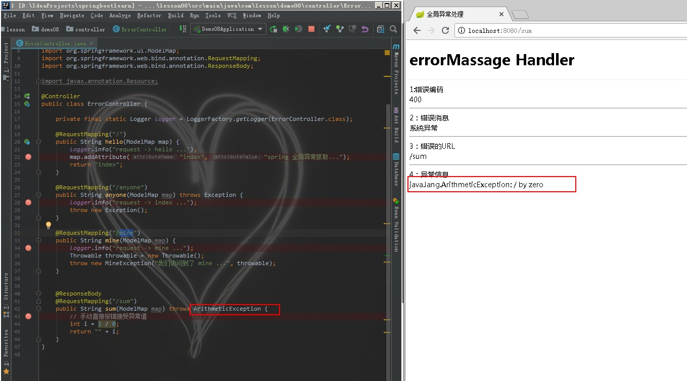

# Spring Boot 全局异常
## 定义异常实体
- 异常实体包括  
    1. 错误编码
    2. 错误消息
    3. 错误的URL
    4. 异常信息

```java
package com.lesson.demo08.pojo;

/***
 * 异常信息实体
 * @param <T>
 */
public class ErrorMassage<T> {
    public static final Integer OK = 0;
    public static final Integer ERROR = 100;

    private Integer code;
    private String message;
    private String url;
    private T data;

    public Integer getCode() {
        return code;
    }

    public void setCode(Integer code) {
        this.code = code;
    }

    public String getMessage() {
        return message;
    }

    public void setMessage(String message) {
        this.message = message;
    }

    public String getUrl() {
        return url;
    }

    public void setUrl(String url) {
        this.url = url;
    }

    public T getData() {
        return data;
    }

    public void setData(T data) {
        this.data = data;
    }
}

```

## 定义异常类
```java
package com.lesson.demo08.exception;

/***
 * 自定义异常
 */
public class MineException extends RuntimeException {
    /**
     * 生成序列异常时
     */
    public static final MineException DB_GET_SEQ_NEXT_VALUE_ERROR = new MineException(10040007, "序列生成超时");
    private static final long serialVersionUID = -1104674993657790702L;
    /**
     * 具体异常码
     */
    protected int code;

    /**
     * 异常信息
     */
    protected String msg;

    /**
     * @param message
     */
    public MineException(String message) {
        super(message);
    }

    public MineException(int code, String msgFormat, Object... args) {
        super(String.format(msgFormat, args));
        this.code = code;
        this.msg = String.format(msgFormat, args);
    }

    public MineException(String message, Throwable cause) {
        super(message, cause);
    }

    public MineException(Throwable cause) {
        super(cause);
    }

    /**
     * 实例化异常
     *
     * @param msgFormat
     * @param args
     * @return
     */
    public MineException newInstance(String msgFormat, Object... args) {
        return new MineException(this.code, msgFormat, args);
    }

    public int getCode() {
        return code;
    }

    public void setCode(int code) {
        this.code = code;
    }

    public String getMsg() {
        return msg;
    }

    public void setMsg(String msg) {
        this.msg = msg;
    }
}

```

## 全局异常处理类
```java
package com.lesson.demo08.controller;

import javax.servlet.http.HttpServletRequest;

import com.lesson.demo08.exception.MineException;
import com.lesson.demo08.pojo.ErrorMassage;
import org.springframework.web.bind.annotation.ControllerAdvice;
import org.springframework.web.bind.annotation.ExceptionHandler;
import org.springframework.web.bind.annotation.ResponseBody;
import org.springframework.web.servlet.ModelAndView;


/***
 * 全局异常控制
 */
@ControllerAdvice
public class GlobalExceptionController {
    /**
     * 在@ControllerAdvice类中，根据抛出的具体Exception类型匹配@ExceptionHandler中配置的异常类型来匹配错误映射和处理
     */
    public static final String DEFAULT_ERROR_VIEW = "error";

    /**
     * 捕获自定义异常，返回json信息
     */
    @ExceptionHandler(value = MineException.class)
    @ResponseBody
    public ErrorMassage<Object> ErrorHandler(HttpServletRequest req, MineException e) throws Exception {
        ErrorMassage<Object> error = new ErrorMassage<>();
        error.setCode(404);
        error.setMessage("Not Found Exception ！！！");
        error.setUrl(req.getRequestURL().toString());
        error.setData(e);
        return error;
    }

    /**
     * @ExceptionHandler用来定义函数针对的异常类型，最后将Exception对象和请求URL映射到error.html中
     */
    @ExceptionHandler(value = Exception.class)
    public ModelAndView ErrorHandler(HttpServletRequest req, Exception e) throws Exception {
        ModelAndView mav = new ModelAndView();
        ErrorMassage<Exception> error = new ErrorMassage<Exception>();
        error.setCode(400);
        error.setMessage("系统异常");
        error.setUrl(req.getRequestURI());
        error.setData(e);
        mav.addObject(error);
        mav.setViewName(DEFAULT_ERROR_VIEW);
        return mav;
    }
}


```
## 定义 ERROR 的页面展示
```thymeleafexpressions
<!DOCTYPE html>
<html xmlns:th="http://www.w3.org/1999/xhtml">
<head lang="en">
    <meta charset="UTF-8"/>
    <title>全局异常处理</title>
</head>
<body>
<h1>errorMassage Handler</h1>
<hr>
1:错误编码</hr>
<div th:text="${errorMassage.code}"></div>
<hr>
2：错误消息</hr>
<div th:text="${errorMassage.message}"></div>
<hr>
3：错误的URL</hr>
<div th:text="${errorMassage.url}"></div>
<hr>
4：异常信息</hr>
<div th:text="${errorMassage.data}"></div>
</body>
</html>
```
## 构造请求
```java
package com.lesson.demo08.controller;

import com.lesson.demo08.exception.MineException;
import org.slf4j.Logger;
import org.slf4j.LoggerFactory;
import org.springframework.stereotype.Controller;
import org.springframework.ui.ModelMap;
import org.springframework.web.bind.annotation.RequestMapping;
import org.springframework.web.bind.annotation.ResponseBody;

@Controller
public class ErrorController {

    private final static Logger logger = LoggerFactory.getLogger(ErrorController.class);

    @RequestMapping("/")
    public String hello(ModelMap map) {
        logger.info("request -> hello ...");
        map.addAttribute("index", "spring 全局异常抓取...");
        return "index";
    }

    @RequestMapping("/anyone")
    public String anyone(ModelMap map) throws Exception {
        logger.info("request -> index ...");
        throw new Exception();
    }

    @RequestMapping("/mine")
    public String mine(ModelMap map) {
        logger.info("request -> mine ...");
        Throwable throwable = new Throwable();
        throw new MineException("我们访问到了 mine ...", throwable);
    }

    @ResponseBody
    @RequestMapping("/sum")
    public String sum(ModelMap map) throws ArithmeticException {
        // 手动直接报错接受异常值
        int i = 1 / 0;
        return "" + i;
    }
}

```
## 后续使用
``使用中有异常直接抛出异常 springboot 会自动处理跳转页面等一些问题``

- 请求截图


