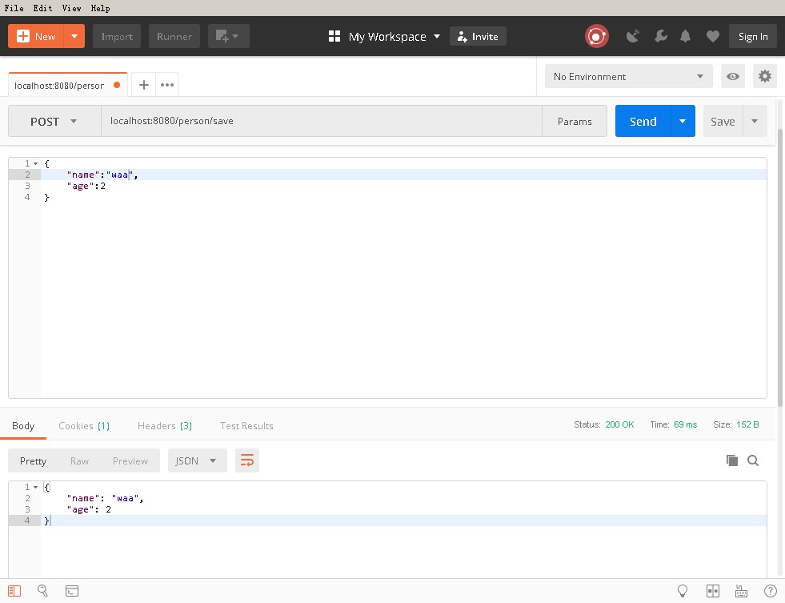
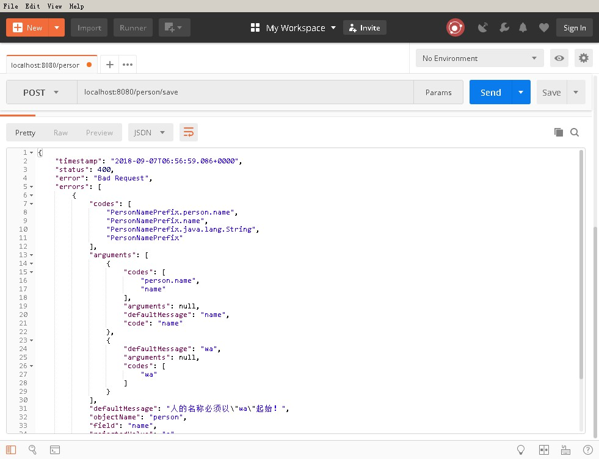

# Spring Boot 验证
## 创建实体
```java
package com.lesson.demo09.domain;

import com.lesson.demo09.bean.validation.constraints.PersonNamePrefix;

public class Person {

    private String name;

    private Integer age;


    public String getName() {
        return name;
    }

    public void setName(String name) {
        this.name = name;
    }

    public Integer getAge() {
        return age;
    }

    public void setAge(Integer age) {
        this.age = age;
    }
}

```
## 注解验证
- @NotNull 不为空
- @Min 最小值
- @Max 最大值
## 自定义验证
```
根据 javax.validation.constraints 写出自定义校验
```
```java
package com.lesson.demo09.bean.validation.constraints;

import com.lesson.demo09.bean.validation.PersonNamePrefixConstraintValidator;

import javax.validation.Constraint;
import javax.validation.Payload;
import java.lang.annotation.Documented;
import java.lang.annotation.Retention;
import java.lang.annotation.Target;

import static java.lang.annotation.ElementType.FIELD;
import static java.lang.annotation.ElementType.METHOD;
import static java.lang.annotation.RetentionPolicy.RUNTIME;

@Target({METHOD, FIELD})
@Retention(RUNTIME)
@Documented
@Constraint(validatedBy = {PersonNamePrefixConstraintValidator.class})
public @interface PersonNamePrefix {

    String message() default "{person.name.prefix.message}";

    Class<?>[] groups() default {};

    Class<? extends Payload>[] payload() default {};

    String prefix() default "a-";

}
```

```java
package com.lesson.demo09.bean.validation;

import com.lesson.demo09.bean.validation.constraints.PersonNamePrefix;

import javax.validation.ConstraintValidator;
import javax.validation.ConstraintValidatorContext;

public class PersonNamePrefixConstraintValidator implements ConstraintValidator<PersonNamePrefix, String> {

    private String prefix;

    @Override
    public void initialize(PersonNamePrefix constraintAnnotation) {
        this.prefix = constraintAnnotation.prefix();
    }

    @Override
    public boolean isValid(String name, ConstraintValidatorContext context) {

        if (!name.startsWith(prefix)) {

            context.disableDefaultConstraintViolation();
            // 自定义文本描述内容
            ConstraintValidatorContext.ConstraintViolationBuilder builder =
                    context.buildConstraintViolationWithTemplate("人的名称必须以\"" + prefix + "\"起始！");
            builder.addConstraintViolation();

            return false;
        }

        return true;
    }
}

```
## 配置到实体类
```java

package com.lesson.demo09.domain;

import com.lesson.demo09.bean.validation.constraints.PersonNamePrefix;

import javax.validation.constraints.Max;
import javax.validation.constraints.Min;
import javax.validation.constraints.NotNull;

public class Person {

    @NotNull
    @PersonNamePrefix(prefix = "wa")
    private String name;

    @Min(value = 0)
    @Max(value = 200    )
    private Integer age;


    public String getName() {
        return name;
    }

    public void setName(String name) {
        this.name = name;
    }

    public Integer getAge() {
        return age;
    }

    public void setAge(Integer age) {
        this.age = age;
    }
}

```

## controller
```java
package com.lesson.demo09.controller;

import com.lesson.demo09.domain.Person;
import org.springframework.web.bind.annotation.PostMapping;
import org.springframework.web.bind.annotation.RequestBody;
import org.springframework.web.bind.annotation.RestController;

import javax.validation.Valid;

@RestController
public class PersonController {

    @PostMapping("/person/save")
    public Person save(@Valid @RequestBody Person person) {
        return person;
    }

}

```

## 请求截图




