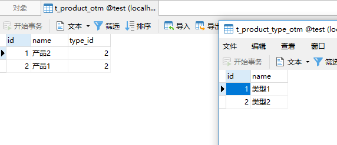

# spring data jpa 关系
## 多对一 单向

- 产品
```java
package com.lesson12.demo12.onwWayManyToOne.entity;

import javax.persistence.Entity;
import javax.persistence.GeneratedValue;
import javax.persistence.GenerationType;
import javax.persistence.Id;
import javax.persistence.JoinColumn;
import javax.persistence.ManyToOne;
import javax.persistence.Table;

/**
 * <p>Title : Product </p>
 * <p>Description : 产品</p>
 *
 * @author huifer
 * @date 2018/11/05
 */
@Entity
@Table(name = "t_product")
public class Product {

    @Id
    @GeneratedValue(strategy = GenerationType.IDENTITY)
    private Long id;
    private String name;
    /** 多对一：optional=false表示外键type_id不能为空 **/
    @ManyToOne(optional = false)
    @JoinColumn(name = "type_id")
    private ProductType type;

    public Product(String name, ProductType type) {
        this.name = name;
        this.type = type;
    }

    public Product() {
    }

    public Long getId() {
        return id;
    }

    public void setId(Long id) {
        this.id = id;
    }

    public String getName() {
        return name;
    }

    public void setName(String name) {
        this.name = name;
    }

    public ProductType getType() {
        return type;
    }

    public void setType(ProductType type) {
        this.type = type;
    }

    @Override
    public String toString() {
        return "Product{" +
                "id=" + id +
                ", name='" + name + '\'' +
                ", type=" + type +
                '}';
    }
}

```
- 产品类型
```java
package com.lesson12.demo12.onwWayManyToOne.entity;

import javax.persistence.Entity;
import javax.persistence.GeneratedValue;
import javax.persistence.GenerationType;
import javax.persistence.Id;
import javax.persistence.Table;

/**
 * <p>Title : ProductType </p>
 * <p>Description : 产品类型</p>
 *
 * @author huifer
 * @date 2018/11/05
 */
@Entity
@Table(name = "t_product_type")
public class ProductType {

    @Id
    @GeneratedValue(strategy = GenerationType.IDENTITY)
    private Long id;
    private String name;

    @Override
    public String toString() {
        return "ProductType{" +
                "id=" + id +
                ", name='" + name + '\'' +
                '}';
    }

    public ProductType() {
    }

    public Long getId() {
        return id;
    }

    public void setId(Long id) {
        this.id = id;
    }

    public String getName() {
        return name;
    }

    public void setName(String name) {
        this.name = name;
    }
}

```
- controller
```java
package com.lesson12.demo12.onwWayManyToOne.controller;

import com.lesson12.demo12.onwWayManyToOne.entity.Product;
import com.lesson12.demo12.onwWayManyToOne.entity.ProductType;
import com.lesson12.demo12.onwWayManyToOne.repo.ProductRepo;
import com.lesson12.demo12.onwWayManyToOne.repo.ProductTypeRepo;
import org.springframework.beans.factory.annotation.Autowired;
import org.springframework.stereotype.Controller;
import org.springframework.web.bind.annotation.GetMapping;

/**
 * <p>Title : m2oController </p>
 * <p>Description : 多对一 </p>
 *
 * @author huifer
 * @date 2018/11/05
 */
@Controller
public class m2oController {

    @Autowired
    private ProductRepo productRepo;
    @Autowired
    private ProductTypeRepo productTypeRepo;

    @GetMapping("m2o")
    @ResponseBody
    public void m2o() {
        ProductType type1 = new ProductType();
        type1.setName("tp1");
        // 会出现异常 java.sql.SQLIntegrityConstraintViolationException: Column 'type_id' cannot be null 
        Product product1 = new Product("产品1", null); 
        Product product2 = new Product("产品2", type1);

        System.out.println("tp1 保存前" + type1);
        productTypeRepo.save(type1);
        System.out.println("tp1 保存后" + type1);

        productRepo.save(product1);
        productRepo.save(product2);

    }

}

```

- 执行以及异常修改
  - 第一次运行项目
    - 异常
    `java.sql.SQLIntegrityConstraintViolationException: Column 'type_id' cannot be null `
  
    - 修复方式
    在实体类Product上的ManyToOne 进行修改
     **`@ManyToOne(optional = true)`**
   
  - 第二次运行项目
    - 异常
      `ERROR 11840 --- [nio-8080-exec-1] o.a.c.c.C.[.[.[/].[dispatcherServlet]    : Servlet.service() for servlet [dispatcherServlet] in context with path [] threw exception [Circular view path [m2o]: would dispatch back to the current handler URL [/m2o] again. Check your ViewResolver setup! (Hint: This may be the result of an unspecified view, due to default view name generation.)] with root cause`
      `javax.servlet.ServletException: Circular view path [m2o]: would dispatch back to the current handler URL [/m2o] again. Check your ViewResolver setup! (Hint: This may be the result of an unspecified view, due to default view name generation.)
       	at org.springframework.web.servlet.view.InternalResourceView.prepareForRendering(InternalResourceView.java:209) ~[spring-webmvc-5.1.2.RELEASE.jar:5.1.2.RELEASE]
       	at org.springframework.web.servlet.view.InternalResourceView.renderMergedOutputModel(InternalResourceView.java:147) ~[spring-webmvc-5.1.2.RELEASE.jar:5.1.2.RELEASE]
       	at org.springframework.web.servlet.view.AbstractView.render(AbstractView.java:316) ~[spring-webmvc-5.1.2.RELEASE.jar:5.1.2.RELEASE]
       	at org.springframework.web.servlet.DispatcherServlet.render(DispatcherServlet.java:1370) ~[spring-webmvc-5.1.2.RELEASE.jar:5.1.2.RELEASE]
       	at org.springframework.web.servlet.DispatcherServlet.processDispatchResult(DispatcherServlet.java:1116) ~[spring-webmvc-5.1.2.RELEASE.jar:5.1.2.RELEASE]
       	at org.springframework.web.servlet.DispatcherServlet.doDispatch(DispatcherServlet.java:1055) ~[spring-webmvc-5.1.2.RELEASE.jar:5.1.2.RELEASE]
       	at org.springframework.web.servlet.DispatcherServlet.doService(DispatcherServlet.java:942) ~[spring-webmvc-5.1.2.RELEASE.jar:5.1.2.RELEASE]
       	at org.springframework.web.servlet.FrameworkServlet.processRequest(FrameworkServlet.java:998) ~[spring-webmvc-5.1.2.RELEASE.jar:5.1.2.RELEASE]
       	at org.springframework.web.servlet.FrameworkServlet.doGet(FrameworkServlet.java:890) ~[spring-webmvc-5.1.2.RELEASE.jar:5.1.2.RELEASE]
      `
    - 修复方式
    增加
      **`@ResponseBody`** 注解
      


## 一对多 单向

- 产品
```java
package com.lesson12.demo12.onwWayOneToMany.entity;

import javax.persistence.Entity;
import javax.persistence.GeneratedValue;
import javax.persistence.GenerationType;
import javax.persistence.Id;
import javax.persistence.Table;

/**
 * <p>Title : Productom </p>
 * <p>Description : 产品</p>
 *
 * @author huifer
 * @date 2018/11/05
 */
@Entity
@Table(name = "t_product_otm")
public class Productom {
    @Id
    @GeneratedValue(strategy = GenerationType.IDENTITY)
    private Long id;
    private String name;

    public Productom() {

    }

    public Productom(String name) {
        this.name = name;
    }

    public Long getId() {
        return id;
    }

    public void setId(Long id) {
        this.id = id;
    }

    public String getName() {
        return name;
    }

    public void setName(String name) {
        this.name = name;
    }

    @Override
    public String toString() {
        return "Productom{" +
                "id=" + id +
                ", name='" + name + '\'' +
                '}';
    }
}

```

- 产品类型
```java
package com.lesson12.demo12.onwWayOneToMany.entity;

import java.util.HashSet;
import java.util.Set;
import javax.persistence.CascadeType;
import javax.persistence.Entity;
import javax.persistence.GeneratedValue;
import javax.persistence.Id;
import javax.persistence.JoinColumn;
import javax.persistence.OneToMany;
import javax.persistence.Table;

/**
 * <p>Title : ProductTypeom </p>
 * <p>Description : 产品类型 一对多</p>
 *
 * @author huifer
 * @date 2018/11/05
 */
@Entity
@Table(name = "t_product_type_otm")
public class ProductTypeom {
    @Id
    @GeneratedValue
    private Long id;
    private String name;
    @OneToMany(cascade= CascadeType.ALL)
    @JoinColumn(name = "type_id")
    private Set<Productom> products = new HashSet<Productom>();

    public ProductTypeom() {
    }

    @Override
    public String toString() {
        return "ProductTypeom{" +
                "id=" + id +
                ", name='" + name + '\'' +
                ", products=" + products +
                '}';
    }

    public Long getId() {
        return id;
    }

    public void setId(Long id) {
        this.id = id;
    }

    public String getName() {
        return name;
    }

    public void setName(String name) {
        this.name = name;
    }

    public Set<Productom> getProducts() {
        return products;
    }

    public void setProducts(Set<Productom> products) {
        this.products = products;
    }
}

```

- controller
```java
package com.lesson12.demo12.onwWayOneToMany.controller;

import com.lesson12.demo12.onwWayOneToMany.entity.ProductTypeom;
import com.lesson12.demo12.onwWayOneToMany.entity.Productom;
import com.lesson12.demo12.onwWayOneToMany.repo.ProductTypeomRepo;
import com.lesson12.demo12.onwWayOneToMany.repo.ProductomRepo;
import javax.sql.DataSource;
import org.springframework.beans.factory.annotation.Autowired;
import org.springframework.stereotype.Controller;
import org.springframework.web.bind.annotation.GetMapping;
import org.springframework.web.bind.annotation.Mapping;
import org.springframework.web.bind.annotation.ResponseBody;
import org.springframework.web.bind.annotation.RestController;

/**
 * <p>Title : o2mController </p>
 * <p>Description : todo</p>
 *
 * @author huifer
 * @date 2018/11/05
 */
@Controller
public class o2mController {

    @Autowired
    private ProductomRepo productomRepo;

    @Autowired
    private ProductTypeomRepo productTypeomRepo;


    @GetMapping("/otm")
    @ResponseBody
    public void otm(){
        ProductTypeom type = new ProductTypeom();
        type.setName("类型1");

        Productom product1 = new Productom("产品1");
        Productom product2 = new Productom("产品2");

        type.getProducts().add(product1);
        type.getProducts().add(product2);

        productTypeomRepo.save(type);
        ProductTypeom type2 = new ProductTypeom();
        type2.setName("类型2");
        type2.getProducts().add(product1);
        type2.getProducts().add(product2);
        productTypeomRepo.save(type2);
    }


}

```

- 执行以及异常修改
  - 没有异常数据成功插入



