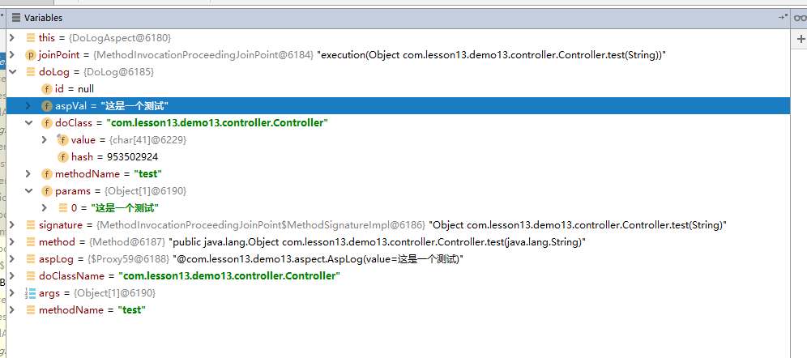

## AOP 使用
```xml
   <dependency>
      <groupId>org.springframework.boot</groupId>
      <artifactId>spring-boot-starter-aop</artifactId>
    </dependency>
```
### 定义注解
```java

@Documented
@Target(ElementType.METHOD)
@Retention(RetentionPolicy.RUNTIME)
public @interface AspLog {

    String value() default "";

}

```
### 定义controller
```java
@RestController
public class Controller {


    @GetMapping("/test/{id}")
    @ResponseBody
    @AspLog(value = "这是一个测试")
    public Object test(@PathVariable("id") String id) {
        return "asdkalsjdklajsdkl";
    }

}

```
### 定义一个aop
 - 如果有需要可以在这里可以将数据储存到数据库中, 演示过程不编写 

```java
package com.lesson13.demo13.aspect;

import com.lesson13.demo13.entity.DoLog;
import java.lang.reflect.Method;
import org.aspectj.lang.JoinPoint;
import org.aspectj.lang.annotation.AfterReturning;
import org.aspectj.lang.annotation.Aspect;
import org.aspectj.lang.annotation.Pointcut;
import org.aspectj.lang.reflect.MethodSignature;
import org.springframework.stereotype.Component;

/**
 * <p>Title : DoLogAspect </p>
 * <p>Description : </p>
 *
 * @author huifer
 * @date 2019-02-26
 */
@Aspect
@Component
public class DoLogAspect {


    @Pointcut("@annotation( com.lesson13.demo13.aspect.AspLog )")
    public void ddlog() {
    }

    @AfterReturning("ddlog()")
    public void save(JoinPoint joinPoint) {
        DoLog doLog = new DoLog();
        MethodSignature signature = (MethodSignature) joinPoint.getSignature();

        // 切点方法
        Method method = signature.getMethod();

        // 自定义注解的获取
        AspLog aspLog = method.getAnnotation(AspLog.class);
        String value;
        if (aspLog != null) {
            value = aspLog.value();
            doLog.setAspVal(value);
        }
        // 当前注解的class
        String doClassName = joinPoint.getTarget().getClass().getName();
        // 请求参数
        Object[] args = joinPoint.getArgs();
        // 请求函数名
        String methodName = method.getName();

        doLog.setDoClass(doClassName);
        doLog.setMethodName(methodName);
        doLog.setParams(args);


        System.out.println();

    }


}

```

### 调试阶段
- 访问http://localhost:8088/test/这是一个测试
查看具体属性




----
## generator 使用
```java
package com.lesson13.demo13.utils;

import static org.mybatis.generator.internal.util.StringUtility.isTrue;

import java.net.URL;
import java.text.SimpleDateFormat;
import java.util.Date;
import java.util.List;
import java.util.Properties;
import java.util.Set;
import org.mybatis.generator.api.IntrospectedColumn;
import org.mybatis.generator.api.IntrospectedTable;
import org.mybatis.generator.api.ShellRunner;
import org.mybatis.generator.api.dom.java.CompilationUnit;
import org.mybatis.generator.api.dom.java.Field;
import org.mybatis.generator.api.dom.java.FullyQualifiedJavaType;
import org.mybatis.generator.api.dom.java.InnerClass;
import org.mybatis.generator.api.dom.java.InnerEnum;
import org.mybatis.generator.api.dom.java.JavaElement;
import org.mybatis.generator.api.dom.java.Method;
import org.mybatis.generator.api.dom.java.Parameter;
import org.mybatis.generator.api.dom.java.TopLevelClass;
import org.mybatis.generator.api.dom.xml.XmlElement;
import org.mybatis.generator.config.MergeConstants;
import org.mybatis.generator.config.PropertyRegistry;
import org.mybatis.generator.internal.DefaultCommentGenerator;


/**
 * <p>Title : TcommentGenerator </p>
 * <p>Description : </p>
 *
 * @author huifer
 * @date 2019-02-26
 */
public class TcommentGenerator extends DefaultCommentGenerator {

    public static void main(String[] args) {
        URL resource = TcommentGenerator.class.getClassLoader().getResource("generatorConfig.xml");
        args = new String[]{"-configfile", resource.getPath(), "-overwrite"};
        ShellRunner.main(args);
    }

    private Properties properties;
    private Properties systemPro;
    private boolean suppressDate;
    private boolean suppressAllComments;
    private String currentDateStr;

    public TcommentGenerator() {
        super();
        properties = new Properties();
        systemPro = System.getProperties();
        suppressDate = false;
        suppressAllComments = false;
        currentDateStr = (new SimpleDateFormat("yyyy-MM-dd")).format(new Date());
    }

    // 首字母转小写
    public static String toLowerCaseFirstOne(String s) {
        if (Character.isLowerCase(s.charAt(0))) {

            return s;
        } else {
            return (new StringBuilder()).append(Character.toLowerCase(s.charAt(0)))
                    .append(s.substring(1)).toString();
        }
    }

    @Override
    public void addJavaFileComment(CompilationUnit compilationUnit) {
        // add no file level comments by default
        return;
    }

    @Override
    public void addComment(XmlElement xmlElement) {
        return;
    }

    @Override
    public void addRootComment(XmlElement rootElement) {
        return;
    }

    @Override
    public void addConfigurationProperties(Properties properties) {
        this.properties.putAll(properties);

        suppressDate = isTrue(
                properties.getProperty(PropertyRegistry.COMMENT_GENERATOR_SUPPRESS_DATE));

        suppressAllComments = isTrue(
                properties.getProperty(PropertyRegistry.COMMENT_GENERATOR_SUPPRESS_ALL_COMMENTS));
    }

    @Override
    protected void addJavadocTag(JavaElement javaElement, boolean markAsDoNotDelete) {
        javaElement.addJavaDocLine(" *");
        StringBuilder sb = new StringBuilder();
        sb.append(" * ");
        sb.append(MergeConstants.NEW_ELEMENT_TAG);
        if (markAsDoNotDelete) {
            sb.append(" do_not_delete_during_merge");
        }
        String s = getDateString();
        if (s != null) {
            sb.append(' ');
            sb.append(s);
        }
        javaElement.addJavaDocLine(sb.toString());
    }

    @Override
    protected String getDateString() {
        String result = null;
        if (!suppressDate) {
            result = currentDateStr;
        }
        return result;
    }

    @Override
    public void addClassComment(InnerClass innerClass, IntrospectedTable introspectedTable) {
        if (suppressAllComments) {
            return;
        }
        StringBuilder sb = new StringBuilder();
        innerClass.addJavaDocLine("/**");
        sb.append(" * ");
        sb.append(introspectedTable.getFullyQualifiedTable());
        sb.append(" ");
        sb.append(getDateString());
        innerClass.addJavaDocLine(sb.toString());
        innerClass.addJavaDocLine(" */");
    }

    @Override
    public void addEnumComment(InnerEnum innerEnum, IntrospectedTable introspectedTable) {
        if (suppressAllComments) {
            return;
        }

        StringBuilder sb = new StringBuilder();

        innerEnum.addJavaDocLine("/**");
        // addJavadocTag(innerEnum, false);
        sb.append(" * ");
        sb.append(introspectedTable.getFullyQualifiedTable());
        innerEnum.addJavaDocLine(sb.toString());
        innerEnum.addJavaDocLine(" */");
    }

    @Override
    public void addFieldComment(Field field, IntrospectedTable introspectedTable,
            IntrospectedColumn introspectedColumn) {
        if (suppressAllComments) {
            return;
        }

        StringBuilder sb = new StringBuilder();

        field.addJavaDocLine("/**");
        sb.append(" * ");
        sb.append(introspectedColumn.getRemarks());
        field.addJavaDocLine(sb.toString());

        // addJavadocTag(field, false);

        field.addJavaDocLine(" */");

        List<IntrospectedColumn> primaryKeyColumns = introspectedTable.getPrimaryKeyColumns();
        for (IntrospectedColumn col : primaryKeyColumns) {
            if (col.getActualColumnName().equals(introspectedColumn.getActualColumnName())) {
                field.addAnnotation("@Id");
            }
        }
        field.addAnnotation("@Column(name = \"" + introspectedColumn.getActualColumnName() + "\")");
    }

    @Override
    public void addFieldComment(Field field, IntrospectedTable introspectedTable) {
        if (suppressAllComments) {
            return;
        }

        StringBuilder sb = new StringBuilder();

        field.addJavaDocLine("/**");
        sb.append(" * ");
        sb.append(introspectedTable.getFullyQualifiedTable());
        field.addJavaDocLine(sb.toString());
        field.addJavaDocLine(" */");
    }

    @Override
    public void addGeneralMethodComment(Method method, IntrospectedTable introspectedTable) {
        if (suppressAllComments) {
            return;
        }
        // method.addJavaDocLine("/**");
        // addJavadocTag(method, false);
        // method.addJavaDocLine(" */");
    }

    @Override
    public void addGetterComment(Method method, IntrospectedTable introspectedTable,
            IntrospectedColumn introspectedColumn) {
        if (suppressAllComments) {
            return;
        }

        method.addJavaDocLine("/**");

        StringBuilder sb = new StringBuilder();
        sb.append(" * ");
        sb.append(introspectedColumn.getRemarks());
        method.addJavaDocLine(sb.toString());

        sb.setLength(0);
        sb.append(" * @return ");
        sb.append(introspectedColumn.getActualColumnName());
        sb.append(" ");
        sb.append(introspectedColumn.getRemarks());
        method.addJavaDocLine(sb.toString());

        // addJavadocTag(method, false);

        method.addJavaDocLine(" */");
    }

    @Override
    public void addSetterComment(Method method, IntrospectedTable introspectedTable,
            IntrospectedColumn introspectedColumn) {
        if (suppressAllComments) {
            return;
        }

        method.addJavaDocLine("/**");
        StringBuilder sb = new StringBuilder();
        sb.append(" * ");
        sb.append(introspectedColumn.getRemarks());
        method.addJavaDocLine(sb.toString());

        Parameter parm = method.getParameters().get(0);
        sb.setLength(0);
        sb.append(" * @param ");
        sb.append(parm.getName());
        sb.append(" ");
        sb.append(introspectedColumn.getRemarks());
        method.addJavaDocLine(sb.toString());

        // addJavadocTag(method, false);

        method.addJavaDocLine(" */");
    }

    @Deprecated
    @Override
    public void addClassComment(InnerClass innerClass, IntrospectedTable introspectedTable,
            boolean markAsDoNotDelete) {

    }

    @Override
    public void addModelClassComment(TopLevelClass topLevelClass,
            IntrospectedTable introspectedTable) {
        topLevelClass.addImportedType("javax.persistence.Column");
        topLevelClass.addImportedType("javax.persistence.Id");
        topLevelClass.addImportedType("javax.persistence.Table");
        topLevelClass.addImportedType("org.apache.ibatis.type.Alias");

        if (suppressAllComments) {
            return;
        }

        StringBuilder sb = new StringBuilder();

        topLevelClass.addJavaDocLine("/**");
        sb.append(" * ");
        sb.append(introspectedTable.getFullyQualifiedTable());
        topLevelClass.addJavaDocLine(sb.toString());

        sb.setLength(0);
        sb.append(" * @author ");
        sb.append(systemPro.getProperty("user.name"));
        sb.append(" ");
        sb.append(currentDateStr);

        // addJavadocTag(innerClass, markAsDoNotDelete);

        topLevelClass.addJavaDocLine(" */");
        topLevelClass.addAnnotation(
                "@Table(name = \"" + introspectedTable.getFullyQualifiedTable() + "\")");
        topLevelClass.addAnnotation("@Alias(\""
                + toLowerCaseFirstOne(
                introspectedTable.getTableConfiguration().getDomainObjectName()) + "\")");
    }

    public void addGeneralMethodAnnotation(Method method, IntrospectedTable introspectedTable,
            Set<FullyQualifiedJavaType> imports) {
        System.out.println(method.getName());

    }

    public void addGeneralMethodAnnotation(Method method, IntrospectedTable introspectedTable,
            IntrospectedColumn introspectedColumn, Set<FullyQualifiedJavaType> imports) {
        System.out.println(method.getName());

    }

    public void addFieldAnnotation(Field field, IntrospectedTable introspectedTable,
            Set<FullyQualifiedJavaType> imports) {
        System.out.println(field.getName());

    }

    public void addFieldAnnotation(Field field, IntrospectedTable introspectedTable,
            IntrospectedColumn introspectedColumn, Set<FullyQualifiedJavaType> imports) {
        System.out.println(field.getName());
        field.addAnnotation("@Column(name = \"" + field.getName() + "\")");
    }

    public void addClassAnnotation(InnerClass innerClass, IntrospectedTable introspectedTable,
            Set<FullyQualifiedJavaType> imports) {
        System.out.println(innerClass);
    }
}

```
